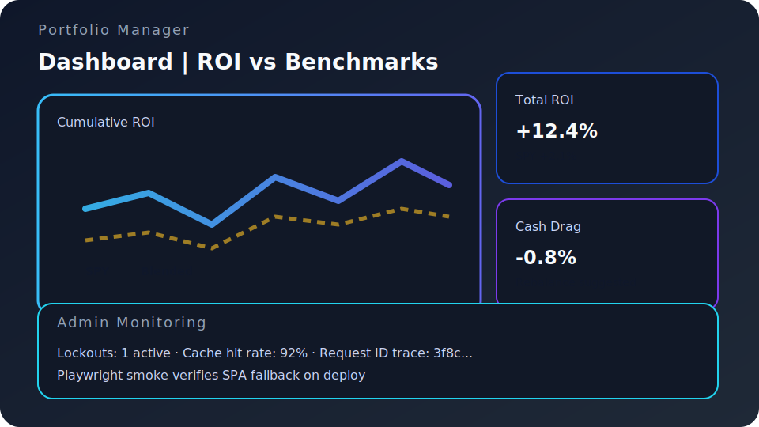
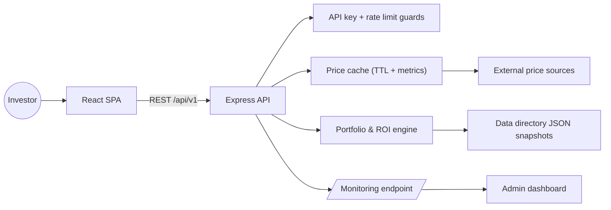

<!-- markdownlint-disable -->
# Portfolio Manager (Server Edition)
> Operates a production-hardened portfolio tracker where investors manage trades, ROI, and operational telemetry from one audited stack.

[](https://github.com/cortega26/portfolio-manager-server/actions/workflows/ci.yml) [](https://www.tooltician.com)  

## Snapshot



## Features
- Enforces hashed API keys, progressive brute-force lockouts, and scoped rate limits for each portfolio tenant.【F:server/middleware/bruteForce.js†L1-L120】【F:server/middleware/validation.js†L1-L160】
- Computes holdings and ROI against SPY, blended benchmarks, and cash drag with deterministic Decimal.js math and property tests.【F:server/finance/returns.js†L1-L200】【F:server/__tests__/ledger.property.test.js†L1-L160】
- Serves React dashboards with `react-window` virtualisation and benchmark toggles that keep accessibility-first table semantics.【F:src/components/TransactionsTab.jsx†L1-L200】【F:src/components/AdminTab.jsx†L1-L200】
- Exposes `/api/monitoring` plus an admin tab that streams lockout, rate-limit, and cache stats in near real time.【F:server/metrics/performanceMetrics.js†L1-L160】【F:src/components/AdminTab.jsx†L1-L200】
- Caches upstream price data with TTL invalidation and surfacing metrics, preventing redundant HTTP calls while staying observable.【F:server/cache/priceCache.js†L1-L200】【F:server/__tests__/priceCache.test.js†L1-L120】
- Bundles deterministic CI gates (lint → typecheck → build → smoke → coverage → Playwright) so deploys only happen after proof.【F:.github/workflows/ci.yml†L1-L76】
- Deploys the static frontend to GitHub Pages behind a CSP-enforced static host with SPA fallbacks validated post-release.【F:.github/workflows/deploy.yml†L1-L64】【F:public/404.html†L1-L120】

> Guardrail excerpt
>
> ```ts
> // Progressive lockouts escalate on every failure without starving legitimate traffic.
> const durationSeconds = Math.min(
>   config.maxLockoutSeconds,
>   config.baseLockoutSeconds * Math.pow(config.progressiveMultiplier, priorCount),
> );
> ```
> — [`server/middleware/bruteForce.js`](server/middleware/bruteForce.js)

## Tech Stack
- **Frontend:** React 18, Vite 7, TailwindCSS, react-window, Recharts.【F:package.json†L27-L70】
- **Backend:** Express 4, Pino logging, Zod validation, node-cache, node-fetch.【F:package.json†L31-L70】
- **Testing & Tooling:** Vitest, @testing-library, Playwright, fast-check, Stryker, ESLint, TypeScript.【F:package.json†L71-L118】
- **CI/CD:** GitHub Actions smoke + coverage workflow chained into GitHub Pages deploy.【F:.github/workflows/ci.yml†L1-L76】【F:.github/workflows/deploy.yml†L1-L64】

## Architecture at a Glance


## Quick Start
1. **Use the project Node version**
   ```bash
   nvm use 20.19.0
   ```
2. **Install dependencies**
   ```bash
   npm ci --no-fund --no-audit
   ```
3. **Copy the environment template**
   ```bash
   cp .env.example .env
   ```
4. **Run backend and frontend in parallel**
   ```bash
   npm run server
   npm run dev
   ```
5. Visit `http://localhost:5173` (frontend) and ensure the API responds at `http://localhost:3000`.

### Configuration quick reference
| Name | Type | Default | Required | Description |
| --- | --- | --- | --- | --- |
| `PORT` | number | `3000` | No | Express API port for the backend server.【F:.env.example†L3-L80】|
| `DATA_DIR` | path | `./data` | No | Directory for portfolio JSON snapshots; keep out of git.【F:.env.example†L9-L80】|
| `CORS_ALLOWED_ORIGINS` | CSV string | `http://localhost:5173` | No | Frontends allowed to reach the API.【F:.env.example†L15-L80】|
| `API_CACHE_TTL_SECONDS` | number | `30` | No | TTL for cached portfolio responses before re-computation.【F:.env.example†L29-L80】|
| `PRICE_CACHE_TTL_SECONDS` | number | `900` | No | Maximum age of price quotes kept in memory cache.【F:.env.example†L33-L80】|
| `BRUTE_FORCE_MAX_ATTEMPTS` | number | `5` | No | Failed auth attempts before progressive lockout begins.【F:.env.example†L45-L80】|
| `VITE_API_BASE` | URL | `http://localhost:3000` | No | Override API origin consumed by the SPA.【F:.env.example†L67-L80】|

## Quality & Tests
- **Smoke + coverage (matches CI):**
  ```bash
  npm run verify:smoke
  NODE_OPTIONS="--trace-warnings --trace-deprecation --throw-deprecation" npm run test:coverage
  ```
- **Component and property tests:**
  ```bash
  NO_NETWORK_TESTS=1 npm run test:fast
  npm run test:node
  ```
- **Static analysis:**
  ```bash
  npm run lint
  npm run verify:typecheck
  ```
- **End-to-end routing check:**
  ```bash
  npx playwright test e2e/admin-routing.spec.ts --config=playwright.admin-static.config.ts --project=chromium
  ```

CI uploads the coverage artifact for every run; wire it to Codecov or Pages when you want a public badge.[^todo-coverage]

## Performance & Accessibility
- `server/cache/priceCache.js` keeps market data fresh without pounding providers while `/api/monitoring` surfaces cache health for dashboards.【F:server/cache/priceCache.js†L1-L200】【F:server/metrics/performanceMetrics.js†L1-L160】
- GitHub Pages deploy enforces a restrictive CSP during build verification so regressions fail fast before publishing.【F:.github/workflows/deploy.yml†L21-L64】
- `docs/POST_DEPLOY_CHECKLIST.md` includes Lighthouse + Linkinator steps for each release; capture the JSON report in `reports/` for audit trails.【F:docs/POST_DEPLOY_CHECKLIST.md†L1-L60】

## Roadmap
- Promote coverage artifact to an automated badge exposed on the README once hosting is wired.[^todo-coverage]
- Expand Playwright suite beyond admin fallback to cover ROI toggles and benchmark resets.
- Automate Lighthouse runs and publish the summary under `docs/lighthouse.md` after each deploy.
- Integrate Web Push or email notifications when nightly price freshness checks fail (extend `server/metrics` pipeline).

## Why It Matters
- Demonstrates secure multi-tenant design: hashed keys, progressive lockouts, and request tracing show disciplined access control.【F:server/middleware/bruteForce.js†L1-L120】【F:server/app.js†L1-L200】
- Highlights data integrity craft: ROI maths rely on Decimal.js plus property tests to avoid floating-point drift in financial reports.【F:server/finance/returns.js†L1-L200】【F:server/__tests__/ledger.property.test.js†L1-L160】
- Proves operational maturity: CI enforces smoke + coverage, gitleaks, npm audit, and Playwright checks before deploys proceed.【F:.github/workflows/ci.yml†L1-L76】
- Shows developer experience empathy: runtime config, API client centralisation, and environment templates minimise onboarding friction.【F:docs/FE_BE_CONTRACT_AUDIT.md†L1-L80】【F:.env.example†L3-L80】
- Surfaces observability discipline: `/api/monitoring`, admin dashboards, and event stores keep security + performance data front and centre.【F:server/metrics/performanceMetrics.js†L1-L160】【F:src/components/AdminTab.jsx†L1-L200】

## Contributing / License
- Open to thoughtful contributions—please open an issue describing the improvement before submitting a PR.
- License not yet published; treat the codebase as all rights reserved unless granted explicit permission.

[^todo-coverage]: TODO: Expose `coverage/lcov-report` via GitHub Pages or Codecov; see [docs/playbooks/testing-strategy.md](docs/playbooks/testing-strategy.md) for rollout steps.
