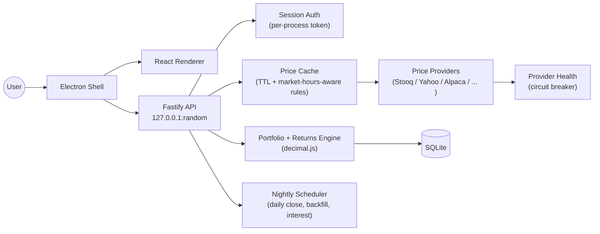

<!-- markdownlint-disable -->

# Portfolio Manager Unified

> Desktop-first portfolio management for investors who want local control, trustworthy pricing context, and auditable performance analytics.

[](https://github.com/cortega26/portfolio-manager-server/actions/workflows/ci.yml)  

Portfolio Manager Unified is a private, desktop-first investing workspace built with Electron, React, Fastify, and SQLite. It keeps portfolio data on your machine, routes all persistence through a local API boundary, and focuses on practical day-to-day workflows: tracking holdings, reviewing signals, comparing performance to benchmarks, importing transaction history, and exporting auditable reports.

## Why This Repo Exists

- **Local-first by design**: no cloud dependency, no shared backend, no direct renderer access to SQLite
- **Safer desktop boundary**: Electron launches a loopback Fastify API and enforces a process-scoped session token
- **Finance-aware calculations**: returns, holdings, cash, and reconciliations use `decimal.js`
- **Actionable monitoring**: prices carry freshness and confidence metadata instead of pretending every quote is equally trustworthy
- **Operational discipline**: linting, typechecks, contract validation, structural complexity checks, and strong automated tests are part of the repo itself

## Support

If Portfolio Manager Unified is useful to you, you can support ongoing independent development through [GitHub Sponsors](https://github.com/sponsors/cortega26) or [Buy Me a Coffee](https://www.buymeacoffee.com/cortega26).

## Core Capabilities

- Multi-portfolio workspace with create, rename, duplicate, delete, and per-portfolio PIN support
- Dashboard with NAV, ROI, allocation, contribution, chart, and inbox-style review surfaces
- Holdings and price views with signal zones, quote freshness, and provider-resolution status
- Transaction workflows for buys, sells, dividends, deposits, withdrawals, splits, and interest
- Benchmark-aware analytics using SPY, QQQ, and blended cash-aware comparisons
- Realized gains and trade statistics views for closed-lot review
- Portfolio comparison tools for side-by-side performance analysis
- CSV import with preview and dry-run support, plus JSON backup/export and restore flows
- Nightly scheduler for price refresh, benchmark backfill, interest accrual, and daily-close jobs
- English and Spanish UI support

## Product Surface

| Area             | What it covers                                                                        |
| ---------------- | ------------------------------------------------------------------------------------- |
| `Dashboard`      | High-signal portfolio overview with NAV, ROI, review cues, charts, and health context |
| `Holdings`       | Open positions, valuation status, signal indicators, and allocation context           |
| `Prices`         | Latest quotes, benchmark pricing, refresh actions, and provider/freshness visibility  |
| `Inbox`          | Action items and review prompts derived from portfolio and pricing state              |
| `Transactions`   | Portfolio ledger editing and search across trading and cash events                    |
| `History`        | Monthly breakdowns and transaction timelines                                          |
| `Metrics`        | KPI cards, allocation views, and performance highlights                               |
| `Realized Gains` | Closed lots, trade outcomes, and tax-year-style review                                |
| `Compare`        | Side-by-side portfolio analytics                                                      |
| `Reports`        | CSV exports, JSON backup/restore, and CSV import entrypoint                           |
| `Settings`       | Notification preferences, display settings, auto-clip behavior, and scheduler status  |

## Architecture


```mermaid
flowchart LR
  user((User)) --> electron[Electron Shell]
  electron --> renderer[React Renderer]
  electron --> fastify[Fastify API<br/>127.0.0.1:random]
  fastify --> session["Session Auth<br/>(per-process token)"]
  fastify --> cache["Price Cache<br/>(TTL + market-hours-aware rules)"]
  cache --> providers["Price Providers<br/>(Stooq / Yahoo / Alpaca / ... )"]
  providers --> health["Provider Health<br/>(circuit breaker)"]
  fastify --> engine["Portfolio + Returns Engine<br/>(decimal.js)"]
  engine --> sqlite[(SQLite)]
  fastify --> scheduler["Nightly Scheduler<br/>(daily close, backfill, interest)"]
```

### Process Boundary

| Layer          | Runtime              | Access                                                         |
| -------------- | -------------------- | -------------------------------------------------------------- |
| React UI       | Chromium renderer    | No direct SQLite access                                        |
| Fastify API    | Node.js main process | SQLite via storage layer, protected by session token           |
| Electron shell | Node.js main process | Starts backend, injects runtime config, owns session bootstrap |
| SQLite storage | Local filesystem     | Only reachable through backend code                            |

## Tech Stack

- **Shell**: Electron with `contextIsolation`
- **Frontend**: React 18, Vite 7, Tailwind CSS, Recharts, Zustand, react-window
- **Backend**: Fastify 5, Zod validation, Pino logging, in-memory API and pricing caches
- **Storage**: SQLite through the repo's `JsonTableStorage` layer
- **Shared logic**: benchmark metadata, trust-state mapping, signals, settings, and precision helpers
- **Testing**: `node:test`, Vitest, Testing Library, Playwright, fast-check, Stryker

## Quick Start

### Prerequisites

- Node.js 24.x
- npm 9+

### Local Development

```bash
npm ci --no-fund --no-audit
npm run doctor
cp .env.example .env
npm run electron:dev
```

For split-process development:

```bash
npm run server
npm run dev
```

### Key Commands

```bash
# Full test suite
npm test

# Backend tests
npm run test:node

# Frontend tests
npx vitest run

# End-to-end tests
npm run test:e2e

# Full quality gate used locally and in CI
npm run verify:quality

# Build verification
npm run verify:build
```

## Quality and Validation

The repo treats quality checks as part of the product, not as optional cleanup.

- `npm run doctor`: verify local bootstrap assumptions
- `npm run docs:check`: validate documentation contracts and paths
- `npm run quality:gates`: confirm docs, scripts, and enforced gates stay aligned
- `npm run codacy:analyze`: generate Codacy SARIF output locally
- `npm run check:complexity`: guard structural complexity drift on touched production files
- `npm run verify:quality`: docs, lint, typecheck, format, Codacy, complexity, build, and tests
- `npm run verify:smoke`: dependency install, lint, typecheck, build, and smoke tests

## Configuration

Copy `.env.example` to `.env`. The defaults are tuned for local development.

### Core Runtime

| Variable                  | Default            | Purpose                                              |
| ------------------------- | ------------------ | ---------------------------------------------------- |
| `NODE_ENV`                | `development`      | Runtime mode                                         |
| `PORT`                    | `3000`             | Standalone Fastify port                              |
| `LOG_LEVEL`               | `info`             | Backend log level                                    |
| `DATA_DIR`                | `./data`           | Directory for SQLite-backed local data               |
| `PORTFOLIO_SESSION_TOKEN` | `dev-secret-token` | Standalone development token when bypassing Electron |

### Feature Flags

| Variable                        | Default | Purpose                                                |
| ------------------------------- | ------- | ------------------------------------------------------ |
| `FEATURES_CASH_BENCHMARKS`      | `true`  | Enable cash accrual and blended benchmark behavior     |
| `FEATURES_MONTHLY_CASH_POSTING` | `false` | Collapse daily interest accrual into a monthly posting |
| `CASH_POSTING_DAY`              | `last`  | Posting day for monthly interest when enabled          |

### Pricing Providers

| Variable                  | Default  | Purpose                                      |
| ------------------------- | -------- | -------------------------------------------- |
| `PRICE_PROVIDER_PRIMARY`  | `stooq`  | Historical/EOD provider                      |
| `PRICE_PROVIDER_FALLBACK` | `yahoo`  | Fallback historical provider                 |
| `PRICE_PROVIDER_LATEST`   | `alpaca` | Latest/intraday quote provider               |
| `ALPACA_API_KEY`          | —        | Alpaca latest-quote credential               |
| `ALPACA_API_SECRET`       | —        | Alpaca latest-quote credential               |
| `TWELVE_DATA_API_KEY`     | —        | Twelve Data latest-quote credential          |
| `TWELVE_DATA_PREPOST`     | `true`   | Include pre/post-market data where supported |

### Benchmarks and Freshness

| Variable                           | Default   | Purpose                                                         |
| ---------------------------------- | --------- | --------------------------------------------------------------- |
| `BENCHMARK_TICKERS`                | `SPY,QQQ` | Benchmarks exposed to the UI and scheduler                      |
| `BENCHMARK_DEFAULT_SELECTION`      | `SPY,QQQ` | Default visible benchmark selection                             |
| `FRESHNESS_MAX_STALE_TRADING_DAYS` | `3`       | Staleness threshold before benchmark data is treated as expired |

### Jobs and Cache

| Variable                              | Default | Purpose                                          |
| ------------------------------------- | ------- | ------------------------------------------------ |
| `JOB_NIGHTLY_ENABLED`                 | `true`  | Enable nightly close processing                  |
| `JOB_NIGHTLY_HOUR`                    | `4`     | UTC hour for nightly job execution               |
| `API_CACHE_TTL_SECONDS`               | `600`   | Private cache lifetime for NAV/returns responses |
| `PRICE_CACHE_TTL_SECONDS`             | `600`   | Historical price cache TTL                       |
| `PRICE_CACHE_LIVE_OPEN_TTL_SECONDS`   | `60`    | Live quote TTL during market hours               |
| `PRICE_CACHE_LIVE_CLOSED_TTL_SECONDS` | `900`   | Live quote TTL outside market hours              |
| `PRICE_CACHE_CHECK_PERIOD`            | `120`   | Cache sweep interval                             |
| `PRICE_FETCH_TIMEOUT_MS`              | `5000`  | Upstream fetch timeout                           |

### Frontend Override

| Variable        | Default                 | Purpose                                         |
| --------------- | ----------------------- | ----------------------------------------------- |
| `VITE_API_BASE` | `http://localhost:3000` | Renderer API base for split-process development |
| `VITE_APP_CSP`  | see `.env.example`      | Renderer Content Security Policy                |

## Project Structure

```text
├── electron/           # Electron shell, preload bridge, runtime handoff
├── server/             # Fastify app, storage, finance engine, jobs, migrations
├── src/                # React renderer, app shell, tabs, hooks, i18n, utilities
├── shared/             # Cross-boundary constants, trust, signals, benchmarks, precision
├── tests/              # E2E, pricing, and redesign-focused test suites
├── scripts/            # Quality gates, bootstrap checks, local tooling, CI helpers
├── tools/              # Test runner and performance harnesses
└── docs/               # ADRs, playbooks, audits, references, and active planning docs
```

## Testing Strategy

- **`node:test`** covers backend behavior, storage, finance math, pricing, migrations, auth, and contracts
- **Vitest + jsdom** covers React components, bootstrap logic, and renderer integrations
- **Playwright** covers smoke and end-to-end browser flows
- **fast-check** is used for property-based verification in finance-sensitive paths
- **Stryker** is used for focused mutation testing on high-value logic

## Notes for Contributors

- Keep changes small, reversible, and test-backed
- Prefer updating the real code and observable contracts before polishing docs
- If you touch quality commands or CI expectations, update the corresponding docs and gate checks together

## License

License not yet published. Treat the repository as all rights reserved unless explicit permission is granted.

---

Built and maintained by **Carlos Ortega** — automation, data systems, and web technical hygiene consulting. Portfolio and services: **[tooltician.com](https://tooltician.com/)**.