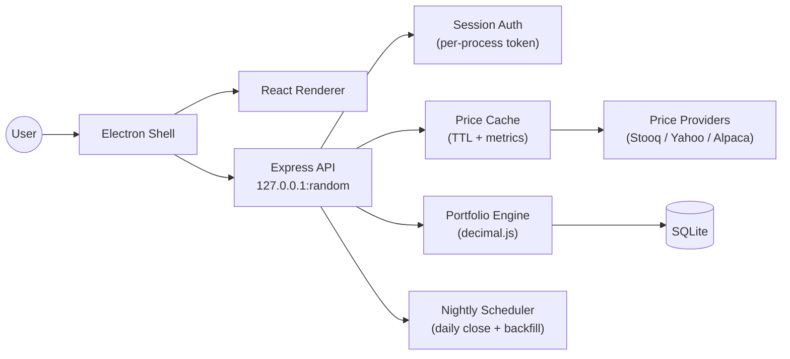

<!-- markdownlint-disable -->

# Portfolio Manager Unified

> A desktop-first portfolio tracker built on Electron + React + Express + SQLite.

[](https://github.com/cortega26/portfolio-manager-server/actions/workflows/ci.yml)  

## Features

- **Desktop-first**: runs as a self-contained Electron app — no cloud, no public API
- **Session-secured**: process-scoped token generated per launch, enforced via middleware
- **PIN-locked portfolios**: local PIN hashing with bcrypt per portfolio
- **SQLite storage**: all data in a single portable `.sqlite` file
- **Real-time signal engine**: BUY/SELL threshold alerts with configurable per-ticker percentages
- **Multi-provider pricing**: Stooq → Yahoo fallback for historical closes, Alpaca/TwelveData for intraday
- **Benchmark tracking**: SPY, QQQ, and blended benchmarks with ROI comparison charts
- **Deterministic finances**: all math via `decimal.js` — no floating-point drift
- **Nightly scheduler**: automated price refresh, benchmark backfill, and NAV recomputation
- **Comprehensive testing**: 325+ node:test assertions, 79+ Vitest tests, property-based tests with fast-check

## Architecture


```mermaid
flowchart LR
  user((User)) --> electron[Electron Shell]
  electron --> renderer[React Renderer]
  electron --> express[Express API<br/>127.0.0.1:random]
  express --> session["Session Auth<br/>(per-process token)"]
  express --> cache["Price Cache<br/>(TTL + metrics)"]
  cache --> providers["Price Providers<br/>(Stooq / Yahoo / Alpaca)"]
  express --> engine["Portfolio Engine<br/>(decimal.js)"]
  engine --> sqlite[(SQLite)]
  express --> scheduler["Nightly Scheduler<br/>(daily close + backfill)"]
```

### Process Boundary

| Layer               | Runs in          | Access                                              |
| ------------------- | ---------------- | --------------------------------------------------- |
| React UI (renderer) | Chromium process | Cannot access SQLite directly                       |
| Express API         | Node.js (main)   | Session token required for every request            |
| Electron shell      | Node.js (main)   | Generates session token, starts Express on loopback |
| SQLite              | Filesystem       | Only accessed via Express storage layer             |

## Tech Stack

- **Shell**: Electron (contextIsolation, no nodeIntegration)
- **Frontend**: React 18, Vite 7, TailwindCSS, Recharts, react-window
- **Backend**: Express 4, Pino logging, Zod validation, node-cache
- **Storage**: better-sqlite3 via `JsonTableStorage`
- **Testing**: Vitest, @testing-library, fast-check, node:test
- **CI**: GitHub Actions (lint → typecheck → test:coverage → gitleaks → npm audit)

## Quick Start

### Prerequisites

- Node.js 20.19.x (use `.nvmrc` or the bundled `.tools/node-v20.19.0-linux-x64/`)
- npm 10+

### Development

```bash
# Install dependencies
npm ci --no-fund --no-audit

# Copy environment template
cp .env.example .env

# Run full stack (Electron + Express + Vite HMR)
npm run electron:dev

# Or run backend + frontend separately
npm run server   # Express on :3000
npm run dev      # Vite on :5173
```

### Testing

```bash
# Full test suite (matches CI)
npm test

# Backend only (node:test)
npm run test:node

# Frontend only (Vitest)
npx vitest run

# With coverage
npm run test:coverage
```

## Configuration

All configuration lives in `.env`. Copy `.env.example` for defaults.

### Core Settings

| Variable    | Default  | Description                        |
| ----------- | -------- | ---------------------------------- |
| `PORT`      | `3000`   | Express API port (standalone mode) |
| `DATA_DIR`  | `./data` | SQLite database directory          |
| `LOG_LEVEL` | `info`   | Pino log level                     |

### Pricing & Benchmarks

| Variable                  | Default   | Description                                              |
| ------------------------- | --------- | -------------------------------------------------------- |
| `PRICE_PROVIDER_PRIMARY`  | `stooq`   | Historical price provider (`stooq`, `yahoo`, `none`)     |
| `PRICE_PROVIDER_FALLBACK` | `none`    | Fallback provider if primary fails                       |
| `PRICE_PROVIDER_LATEST`   | `alpaca`  | Intraday quote provider (`alpaca`, `twelvedata`, `none`) |
| `ALPACA_API_KEY`          | —         | Alpaca Market Data API key                               |
| `ALPACA_API_SECRET`       | —         | Alpaca Market Data API secret                            |
| `BENCHMARK_TICKERS`       | `SPY,QQQ` | Market benchmarks for ROI comparison                     |

### Scheduler

| Variable              | Default | Description                        |
| --------------------- | ------- | ---------------------------------- |
| `JOB_NIGHTLY_ENABLED` | `true`  | Enable nightly close scheduler     |
| `JOB_NIGHTLY_HOUR`    | `4`     | UTC hour for nightly recomputation |

### Cache & Performance

| Variable                              | Default | Description                                 |
| ------------------------------------- | ------- | ------------------------------------------- |
| `PRICE_CACHE_TTL_SECONDS`             | `600`   | TTL for historical price cache              |
| `PRICE_CACHE_LIVE_OPEN_TTL_SECONDS`   | `60`    | TTL for intraday prices during market hours |
| `PRICE_CACHE_LIVE_CLOSED_TTL_SECONDS` | `900`   | TTL for prices outside market hours         |

## Project Structure

```
├── electron/           # Electron main process + preload
│   ├── main.cjs        # Shell bootstrap, session token, IPC
│   ├── preload.cjs     # Secure renderer bridge
│   └── runtimeConfig.js
├── server/             # Express backend
│   ├── app.js          # Express composition
│   ├── data/           # SQLite storage, price providers
│   ├── finance/        # Portfolio engine, ROI, cash
│   ├── jobs/           # Nightly scheduler, daily close
│   ├── middleware/      # Session auth, validation
│   └── migrations/     # SQLite schema migrations
├── src/                # React frontend
│   ├── App.jsx         # Router root
│   ├── PortfolioManagerApp.jsx  # Main app shell
│   ├── components/     # Tab UIs (Dashboard, Holdings, etc.)
│   └── lib/            # API client, runtime config
├── shared/             # Shared constants, settings, benchmarks
└── context/            # Project documentation
```

## Contributing / License

- Open to thoughtful contributions — please open an issue first.
- License not yet published; treat as all rights reserved unless granted explicit permission.
