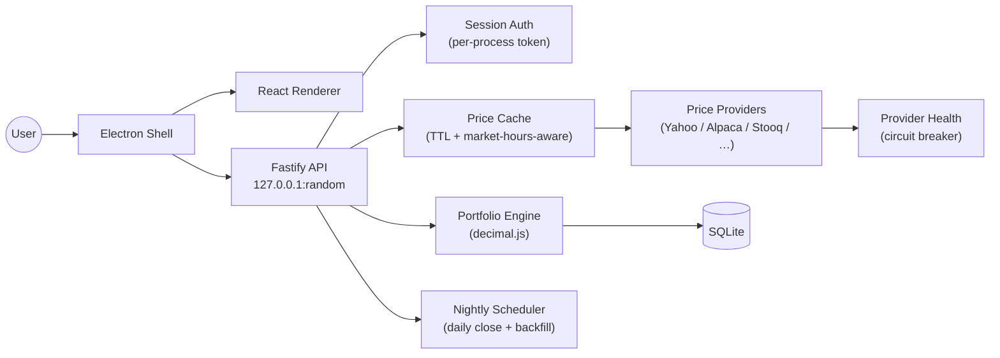

<!-- markdownlint-disable -->

# Portfolio Manager Unified

> A desktop-first portfolio tracker built on Electron + React + Fastify + SQLite.

[](https://github.com/cortega26/portfolio-manager-server/actions/workflows/ci.yml)  

## Features

- **Desktop-first**: self-contained Electron app — no cloud, no public API, data stays local
- **Multi-portfolio**: create, rename, duplicate, delete portfolios with individual PIN locks (bcrypt)
- **Session-secured**: process-scoped token generated per launch, enforced via Fastify middleware
- **SQLite storage**: all portfolios in a single portable `.sqlite` file
- **Signal engine**: BUY/TRIM/HOLD zone evaluation per ticker with configurable thresholds
- **Trust metadata**: per-datapoint freshness, source, and confidence tracking with visual badges
- **Price provider health**: circuit-breaker monitor that tracks provider failures and cooldowns
- **Multi-provider pricing**: Yahoo, Alpaca, Stooq, Alpha Vantage, Twelve Data with fallback chains
- **Benchmark comparison**: SPY, QQQ, and cash-matched blended benchmarks with ROI comparison
- **Review cadence**: daily portfolio health bar, needs-attention alerts, recent changes, and data blockers
- **i18n**: English and Spanish translations throughout the UI
- **Deterministic finances**: all math via `decimal.js` — no floating-point drift
- **Nightly scheduler**: automated price refresh, benchmark backfill, and NAV recomputation
- **Comprehensive testing**: 1,470+ node:test assertions, 90+ Vitest tests, property-based tests with fast-check, mutation testing

## Tabs

| Tab            | Description                                                           |
| -------------- | --------------------------------------------------------------------- |
| Dashboard      | Portfolio overview with charts, zone cards, and performance snapshots |
| Holdings       | Current positions with signal indicators and pricing status           |
| Prices         | Live price board with refresh controls and provider status            |
| Inbox          | Signal alerts, action items, and review prompts                       |
| Transactions   | CRUD operations for buy/sell/dividend transactions                    |
| History        | Monthly breakdown and NAV timeline                                    |
| Metrics        | KPI cards, allocations, rolling returns, Sharpe ratio, drawdown       |
| Realized Gains | Closed lot P&L with holding periods                                   |
| Compare        | Side-by-side portfolio comparison                                     |
| Reports        | Export/import transactions and holdings (CSV, JSON)                   |
| Settings       | App configuration, scheduler status, data management                  |

## Architecture


```mermaid
flowchart LR
  user((User)) --> electron[Electron Shell]
  electron --> renderer[React Renderer]
  electron --> fastify[Fastify API<br/>127.0.0.1:random]
  fastify --> session["Session Auth<br/>(per-process token)"]
  fastify --> cache["Price Cache<br/>(TTL + market-hours-aware)"]
  cache --> providers["Price Providers<br/>(Yahoo / Alpaca / Stooq / …)"]
  providers --> health["Provider Health<br/>(circuit breaker)"]
  fastify --> engine["Portfolio Engine<br/>(decimal.js)"]
  engine --> sqlite[(SQLite)]
  fastify --> scheduler["Nightly Scheduler<br/>(daily close + backfill)"]
```

### Process Boundary

| Layer               | Runs in          | Access                                              |
| ------------------- | ---------------- | --------------------------------------------------- |
| React UI (renderer) | Chromium process | No direct SQLite access                             |
| Fastify API         | Node.js (main)   | SQLite via storage layer, session token required    |
| Electron shell      | Node.js (main)   | Generates session token, starts Fastify on loopback |
| SQLite              | Filesystem       | Only accessed through backend storage               |

## Tech Stack

- **Shell**: Electron (contextIsolation, no nodeIntegration)
- **Frontend**: React 18, Vite 7, TailwindCSS, Recharts, react-window, Zustand
- **Backend**: Fastify 5, Pino, Zod validation, in-memory caching with market-hours-aware TTLs
- **Storage**: SQLite via `JsonTableStorage` layer (`server/data/storage.js`)
- **i18n**: Custom provider with English and Spanish translations
- **Testing**: node:test, Vitest + @testing-library/react, Playwright, fast-check, Stryker (mutation)
- **CI**: GitHub Actions (13-step pipeline: bootstrap → lint → typecheck → quality → smoke → coverage → gitleaks → audit)

## Quick Start

### Prerequisites

- Node.js 24.x LTS (use `.nvmrc`)
- npm 10+

### Development

```bash
# Install dependencies
npm ci --no-fund --no-audit

# Verify local bootstrap assumptions
npm run doctor

# Copy environment template
cp .env.example .env

# Run full stack (Electron + Fastify + Vite HMR)
npm run electron:dev

# Or run backend + frontend separately
npm run server   # Fastify on :3000
npm run dev      # Vite on :5173
```

### Testing

```bash
# Full test suite (matches CI)
npm test

# Backend only (node:test)
npm run test:node

# Frontend only (Vitest)
npx vitest run

# With coverage
npm run test:coverage

# Mutation testing (focused on ROI utilities)
npm run mutate

# E2E (requires build first)
npm run test:e2e
```

### Quality Gates

```bash
# Verify doc contracts and paths
npm run docs:check

# Full quality suite: lint → typecheck → format → build → tests
npm run verify:quality

# Smoke gate: deps → lint → typecheck → build → smoke tests
npm run verify:smoke

# Check quality-gate alignment across docs, scripts, and CI
npm run quality:gates

# Single-command quality check
npm run doctor
```

## Configuration

Copy `.env.example` to `.env`. All configuration is read from environment variables.

### Core

| Variable    | Default  | Description                      |
| ----------- | -------- | -------------------------------- |
| `PORT`      | `3000`   | Local API port (standalone mode) |
| `DATA_DIR`  | `./data` | SQLite database directory        |
| `LOG_LEVEL` | `info`   | Pino log level                   |

### Pricing

| Variable                  | Default  | Description                                                                    |
| ------------------------- | -------- | ------------------------------------------------------------------------------ |
| `PRICE_PROVIDER_PRIMARY`  | `yahoo`  | Historical price provider (`yahoo`, `stooq`, `alpaca`, `alphavantage`, `none`) |
| `PRICE_PROVIDER_FALLBACK` | `none`   | Fallback if primary fails                                                      |
| `PRICE_PROVIDER_LATEST`   | `alpaca` | Intraday quote provider (`alpaca`, `twelvedata`, `finnhub`, `none`)            |
| `ALPACA_API_KEY`          | —        | Alpaca Market Data API key                                                     |
| `ALPACA_API_SECRET`       | —        | Alpaca Market Data API secret                                                  |
| `STOOQ_API_KEY`           | —        | Stooq API key (required for Stooq)                                             |

### Cache

| Variable                              | Default | Description                    |
| ------------------------------------- | ------- | ------------------------------ |
| `PRICE_CACHE_TTL_SECONDS`             | `600`   | TTL for historical price cache |
| `PRICE_CACHE_LIVE_OPEN_TTL_SECONDS`   | `60`    | TTL during market hours        |
| `PRICE_CACHE_LIVE_CLOSED_TTL_SECONDS` | `900`   | TTL outside market hours       |

### Benchmarks

| Variable            | Default   | Description                          |
| ------------------- | --------- | ------------------------------------ |
| `BENCHMARK_TICKERS` | `SPY,QQQ` | Market benchmarks for ROI comparison |

### Scheduler

| Variable              | Default | Description                        |
| --------------------- | ------- | ---------------------------------- |
| `JOB_NIGHTLY_ENABLED` | `true`  | Enable nightly close scheduler     |
| `JOB_NIGHTLY_HOUR`    | `4`     | UTC hour for nightly recomputation |

## Project Structure

```
├── electron/           # Electron main process + preload
│   ├── main.cjs        # Shell bootstrap, session token, IPC
│   ├── preload.cjs     # Secure renderer bridge
│   └── runtimeConfig.js
├── server/             # Fastify backend
│   ├── app.fastify.ts  # App factory (Zod validation, DI)
│   ├── data/           # SQLite storage, price providers, health monitor
│   ├── finance/        # Portfolio engine, returns, cash, lot matcher (decimal.js)
│   ├── routes/         # REST handlers (portfolio, prices, signals, health, etc.)
│   ├── plugins/        # Session auth, request context, ETag, SPA fallback
│   ├── jobs/           # Nightly scheduler, daily close
│   ├── migrations/     # SQLite schema migrations
│   ├── import/         # CSV portfolio import
│   ├── services/       # Historical price loader
│   └── __tests__/      # Backend tests (node:test)
├── src/                # React frontend
│   ├── App.jsx         # Router root
│   ├── PortfolioManagerApp.jsx  # Main app shell
│   ├── components/     # Tab components (Dashboard, Holdings, Inbox, etc.)
│   ├── hooks/          # Custom hooks (usePortfolioData, usePerformanceData, etc.)
│   ├── i18n/           # Translations (English, Spanish)
│   ├── state/          # Zustand store (portfolioStore.js)
│   ├── lib/            # API client, runtime config
│   └── __tests__/      # Frontend tests (Vitest)
├── shared/             # Isomorphic modules (server + client)
│   ├── benchmarks.js   # SPY, QQQ, blended benchmark definitions
│   ├── constants.js    # Cache TTLs, rate limits, schema versions
│   ├── precision.js    # decimal.js precision settings
│   ├── signals.js      # Signal evaluation engine (buy/trim/hold zones)
│   ├── trust.ts        # Trust metadata schema (freshness, source, confidence)
│   └── policy.js       # Portfolio policy schema and evaluator
├── tests/
│   ├── e2e/            # Playwright E2E tests
│   ├── prices/         # Price-specific node:test tests
│   └── redesign/       # Redesign node:test + vitest tests
├── docs/
│   ├── adr/            # Architecture Decision Records (11 records)
│   ├── audits/         # Security and code quality audits
│   └── ...             # Guides, backlog, reference, operations
├── scripts/            # Dev/CI tool scripts
└── tools/              # Test runner, perf suite
```

## Key Libraries

| Library      | Use                                                |
| ------------ | -------------------------------------------------- |
| `decimal.js` | All monetary and share arithmetic — no float drift |
| `zod`        | Runtime schema validation on API boundaries        |
| `zustand`    | Frontend state management                          |
| `pino`       | Structured logging (backend)                       |
| `bcrypt`     | Portfolio PIN hashing                              |
| `recharts`   | Performance and allocation charts                  |
| `fast-check` | Property-based testing for finance engine          |

## Contributing / License

- Open to thoughtful contributions — please open an issue first.
- License not yet published; treat as all rights reserved unless granted explicit permission.
