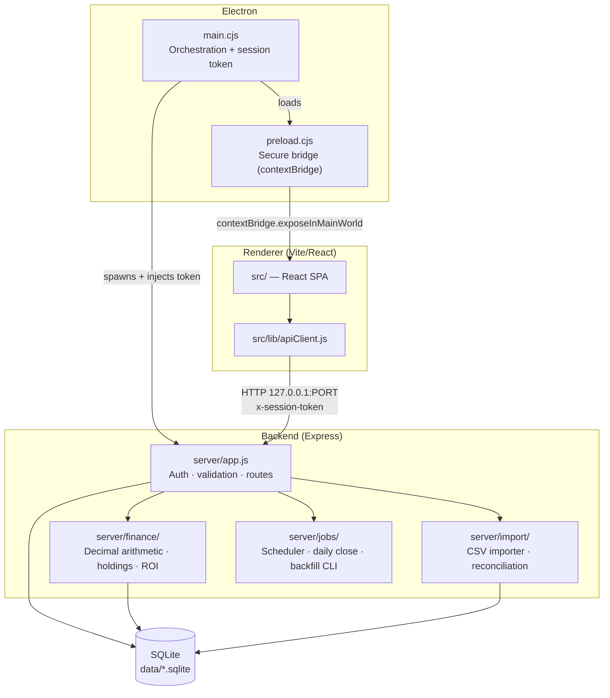

# ARCHITECTURE.md

Carga este archivo cuando la tarea cruce boundaries entre renderer, Electron, backend, storage o auth.

## Propósito

Describir la forma del sistema y sus fronteras sin mezclar estado de roadmap ni detalle operativo.

## Forma general del runtime

1. Electron `main` levanta el shell desktop y orquesta el runtime local.
2. Electron `main` conserva el contexto seguro del proceso y la autenticación de sesión local.
3. Electron `preload` expone el bridge mínimo y seguro hacia el renderer.
4. El renderer React/Vite consume runtime config y llama a la API local; no toca SQLite directamente.
5. Express concentra auth, validación, finanzas, importaciones, jobs y acceso a datos.
6. SQLite es la persistencia backend.
7. CLI y scheduler corren junto al backend, no dentro del renderer.

## Boundaries duros

- Renderer:
  - sin acceso directo a SQLite
  - sin manejo directo de secretos
  - sin bypass alternativo al preload/API
- Preload:
  - bridge mínimo
  - no lógica de dominio
- Electron `main`:
  - orquestación de proceso y contexto seguro
  - no lógica financiera distribuida
- Express:
  - source of truth para lecturas, escrituras y lógica de negocio backend
- Storage y finanzas:
  - reglas de dominio server-side y testeables

## Flujos principales

### Bootstrap desktop

- Electron inicia runtime local.
- `main` prepara contexto de sesión y config runtime.
- `preload` expone el bridge seguro.
- El renderer desbloquea/bootstrappea y luego usa la API local.

### Flujo de request

- Renderer llama al cliente API compartido.
- Express autentica y valida.
- Backend calcula y/o persiste contra SQLite.
- La respuesta vuelve por la misma boundary local.

### Flujo de importación histórica

- La capa CLI/import lee los CSV definidos.
- El importador normaliza registros y aplica reglas explícitas de reconciliación.
- La persistencia escribe transacciones deterministas.
- El estado reconciliado se expone por los contratos backend normales.

## Topología de procesos

**Reglas que el diagrama hace explícitas:**

- `REACT` nunca toca `DB` directamente.
- `PRELOAD` solo expone el bridge; no contiene lógica de dominio.
- `MAIN` es el único punto que genera el session token.

## Olores de arquitectura a rechazar

- lógica de dominio crítica solo en renderer
- acceso directo del renderer o preload a la base
- reintroducción de JSON como persistencia primaria
- reglas de negocio partidas entre renderer, Electron y backend sin razón fuerte
